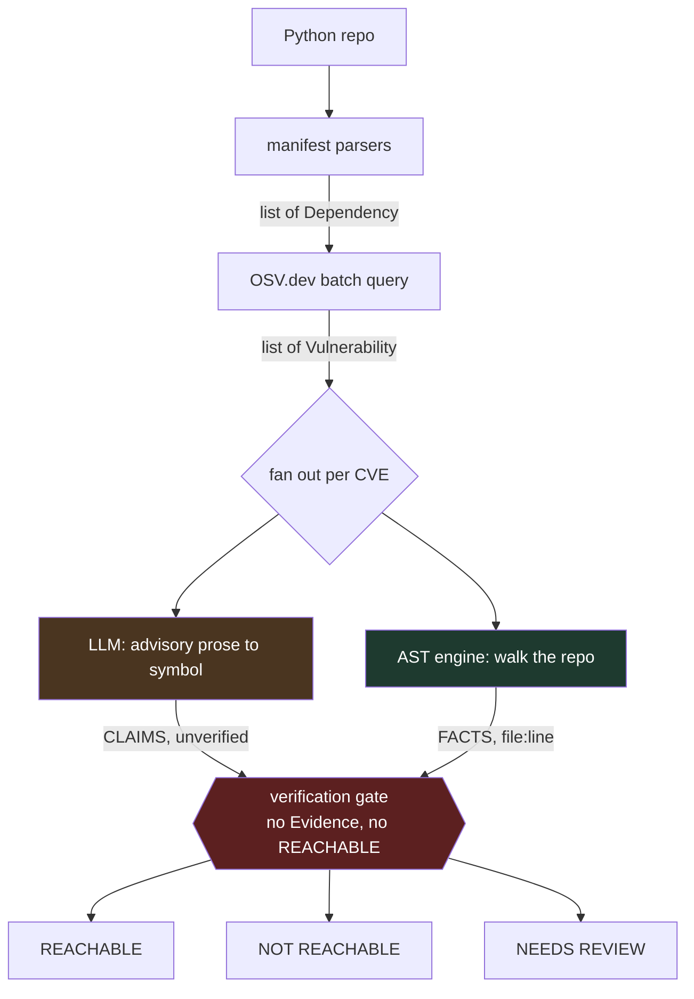

# DepTrace

**Triages dependency CVEs by call-path reachability — it proves which vulnerabilities your code actually touches.**

[](https://github.com/harshithh-18/DepTrace/actions/workflows/ci.yml)


```
PACKAGE      VULNERABILITY         SEV        VERDICT         WHERE
pyyaml 5.3   GHSA-6757-jp84-gxfx   CRITICAL   REACHABLE       app/config.py:42
jinja2 2.10  GHSA-462w-v97r-4m45   HIGH       NOT REACHABLE   —
requests     GHSA-9wx4-h78v-vm56   MODERATE   NEEDS REVIEW    (dynamic import)

1 reachable · 1 needs review · 1 not reachable of 3 advisories
Noise reduction: 33% — alerts shown to be unreachable.
```

---

## The problem

`pyyaml` has hundreds of functions. CVE-2020-1747 affects exactly one of them:
`yaml.load`. If your code only ever calls `yaml.safe_load`, that CVE cannot
touch you.

Existing scanners — Dependabot, Snyk, `pip-audit` — answer *"is this package
installed?"*. They cannot answer *"does your code call the broken part?"*.
The result is 47 alerts where 3 matter, developers who learn to ignore all
47, and real vulnerabilities that slip through in the noise.

That is alert fatigue, and it is the actual security failure.

## What DepTrace does

Point it at a Python repo. It reads your manifests, queries OSV for known
CVEs, uses an LLM to extract *which symbol* each advisory implicates, then
walks your AST to check whether that symbol is genuinely imported and called.

Every `REACHABLE` verdict carries a `file:line` you can open and check.

---

## Quickstart — no accounts, no API keys

```bash
git clone https://github.com/harshithh-18/DepTrace
cd DepTrace
uv sync
uv run deptrace scan .
```

That is the whole setup. SQLite for state, on-disk cache for advisories,
OSV.dev needs no key, and the LLM defaults to a local Ollama model.

```bash
uv run deptrace scan . --no-llm                # fast: deterministic layers only
uv run deptrace scan . -f sarif -o out.sarif   # GitHub code scanning
uv run deptrace scan . --offline               # cached advisories, zero network
uv run deptrace history                        # past scans
uv run deptrace providers                      # which model is selected
```

### As a CI gate

Exit codes are the contract:

| Code | Meaning |
| --- | --- |
| `0` | Clean — nothing reachable |
| `1` | Reachable findings present |
| `2` | The scan itself failed |

Code `2` is deliberately distinct: an outage must never be mistaken for a
security finding.

```yaml
- run: uv run deptrace scan . --fail-on reachable
```

---

## How it works



### The trust boundary

This is the core idea, and it is enforced by the type system rather than by
convention.

| Component | Produces | Trust |
| --- | --- | --- |
| **LLM** (advisory → symbol) | **Claims** — `VulnerableSymbol` | Unverified, may hallucinate, carries `confidence` |
| **AST engine** (code → call site) | **Facts** — `Evidence` | Deterministic, re-checkable, carries `file:line` |

`Evidence.produced_by` is typed `Literal["ast_engine"]`. mypy rejects any
other producer at check time; Pydantic rejects it at runtime. **The LLM layer
cannot construct evidence** — not "should not", *cannot*.

`verify.py` is the single gate: no `Evidence`, no `REACHABLE` verdict. An
unsupported claim is downgraded to `NEEDS_REVIEW` and counted.

Claims carry `confidence`; facts do not. That asymmetry *is* the architecture.

### Three-state verdicts

`REACHABLE` / `NOT_REACHABLE` / `NEEDS_REVIEW` — never a binary. Dynamic
imports and vague advisories are routed honestly to review rather than
guessed at. A finding defaults to `NEEDS_REVIEW`: uncertain until proven
otherwise.

---

## Benchmark results

Measured by `uv run python evals/run_eval.py` against a labeled dataset of
15 cases across 13 fixtures. Reproducible on any clone — no keys required.

| Metric | Value |
| --- | --- |
| Precision (reachable) | 1.00 |
| Recall (reachable) | 1.00 |
| F1 | 1.00 |
| Three-state accuracy | 1.00 |
| Location accuracy | 1.00 |
| Noise reduction | 40% |
| **False negatives** | **0** |
| Unsupported claims blocked | 1 |
| Mean latency per case | 4–11 ms |
| Labeled cases | 15 |

```
Confusion matrix (REACHABLE class)
  True positives     7
  False positives    0   (false alarms)
  False negatives    0   <- CRITICAL: missed CVEs
  True negatives     8
```

**What these numbers mean — and what they do not.** Each dataset row supplies
its own symbol list, standing in for what the LLM would extract. That
isolates the component under test: the AST engine and the gate must be
*correct*; extraction must be *good*. Conflating them would mean a model's
bad day silently looked like a reachability regression. **So this measures
the deterministic core given correct claims — not end-to-end extraction
quality.**

**The eval is verified to actually detect regressions.** A perfect score is
a red flag, so the matcher was deliberately broken (dot-boundary matching
replaced with naive `startswith`) and the suite re-run. It still scored 1.00 —
every decoy in the dataset differed too early in the string to expose the
bug. A `prefix_decoy` fixture was added (`yaml.loader`, `yaml.load_all` vs.
target `yaml.load`); with the same bug injected it now reports:

```
REGRESSION: precision 0.875 < 1.0
fx-prefix-decoy    not_reachable    reachable    FAIL    app.py:23
```

CI runs the eval with `--fail-under-recall 1.0`: a single missed reachable
CVE fails the build, because that failure looks exactly like a clean scan.

### The hallucination gate, tested adversarially

A deliberately lying extractor, claiming fabricated symbols at 0.99
confidence across 16 real advisories:

```
REACHABLE = 0
findings claiming REACHABLE with no evidence: 0
```

### Performance

The AST engine on real codebases (no network, no LLM):

| Repo | Files | Evidence | Dynamic flags | Time |
| --- | --- | --- | --- | --- |
| `psf/requests` | 37 | 5 | 10 | 98 ms |
| `pallets/flask` | 83 | 384 | 16 | 146 ms |

---

## Known limitations

Stated plainly, because a security tool that oversells itself is worse than
no tool.

- **Dynamic dispatch is statically undecidable.** `getattr(mod, name)`,
  `importlib.import_module(name)`, `eval`, `exec` — where the target is
  computed at runtime, DepTrace flags the file and routes findings to
  `NEEDS_REVIEW`. It does not pretend to resolve them.
- **First-party code only.** DepTrace analyzes *your* code. A transitive
  dependency may itself call the vulnerable path; v1 does not trace through
  installed packages, so `NOT_REACHABLE` means "your code does not call it".
- **Advisories often name no function.** Many only describe an impact. The
  LLM correctly returns nothing, and the finding lands in `NEEDS_REVIEW`.
  This is the design working, not a bug — but it caps how much noise can be
  removed on any given advisory set.
- **Local model quality varies.** `qwen2.5-coder:7b` works but is slow
  (143–296 s per advisory on modest hardware) and occasionally returns
  correct content in the wrong envelope. A salvage parser recovers most of
  those. `qwen2.5-coder:1.5b` ignores structured output entirely. **The
  keyless path guarantees the tool runs, not that it runs well** — set
  `GROQ_API_KEY` or `GEMINI_API_KEY` for better extraction.
- **Python only in v1.** A deliberate scope decision, not an omission — see
  [ADR-005](DESIGN.md#adr-005--python-only-in-v1).
- **No type inference.** `obj.method().chained()` cannot be resolved without
  knowing the return type. DepTrace declines to guess rather than reporting
  a maybe.

---

## Project layout

```
src/deptrace/
├── core/
│   ├── state.py           domain models — the contract between layers
│   └── orchestrator.py    plan → parallel triage → synthesize
├── providers/
│   ├── llm/               Ollama · Groq · Gemini (claims)
│   ├── vulndb/            OSV.dev client, cache, PEP 440 ranges
│   └── store/             SQLite persistence
├── tools/
│   ├── manifest.py        requirements / pyproject / uv.lock
│   ├── names.py           pyyaml→yaml, beautifulsoup4→bs4, …
│   └── reachability.py    ← THE MOAT: pure, deterministic, tested
├── verify.py              ← the evidence gate
├── report.py              table · json · markdown · sarif
└── cli.py

evals/
├── dataset.jsonl          15 labeled cases
├── fixtures/              13 mini-repos with known ground truth
└── run_eval.py            precision / recall / F1 / confusion matrix
```

**Dependencies point inward.** `providers/` and `tools/` import from `core/`;
`core/` imports from neither. That is what keeps the core stateless, testable
with no network, and able to run the entire eval suite offline in CI.

---

## Development

```bash
uv run pytest -q                      # 289 tests, fully offline
uv run mypy src                       # strict
uv run ruff check .
uv run python evals/run_eval.py       # the regression gate
```

The test suite **blocks outbound sockets** (`tests/conftest.py`). A test that
reaches the network fails loudly with the address it tried — the "runs
offline in CI" property is enforced, not asserted.

8 direct runtime dependencies. For a tool whose thesis is "your dependency
tree is a liability", that is a design constraint rather than an accident.

## Roadmap

- Multi-language support (JavaScript first — the `tools/` layer is the seam)
- Transitive path analysis: does a dependency reach the vulnerable path?
- Caller-path tracing with bounded BFS from the call site
- GitHub Action packaging
- MCP server exposing the reachability tools

## Design decisions

Five ADRs in [DESIGN.md](DESIGN.md), each with what it cost:

1. [The LLM proposes, static analysis verifies](DESIGN.md#adr-001--the-llm-proposes-static-analysis-verifies)
2. [Three-state verdicts, never binary](DESIGN.md#adr-002--three-state-verdicts-never-binary)
3. [No graph framework for orchestration](DESIGN.md#adr-003--no-graph-framework-for-orchestration)
4. [SQLite/diskcache defaults; the tool must run keyless](DESIGN.md#adr-004--sqlite-and-diskcache-defaults-the-tool-must-run-keyless)
5. [Python-only in v1](DESIGN.md#adr-005--python-only-in-v1)

## License

MIT — see [LICENSE](LICENSE).
